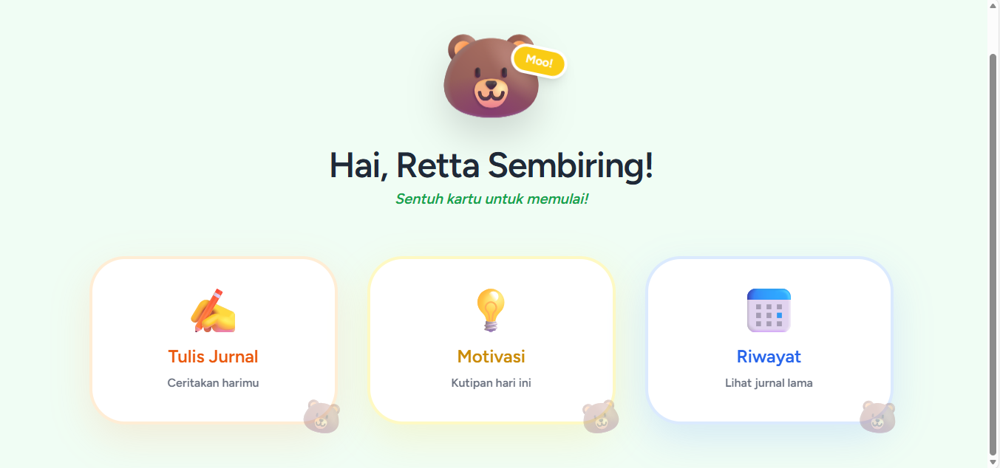
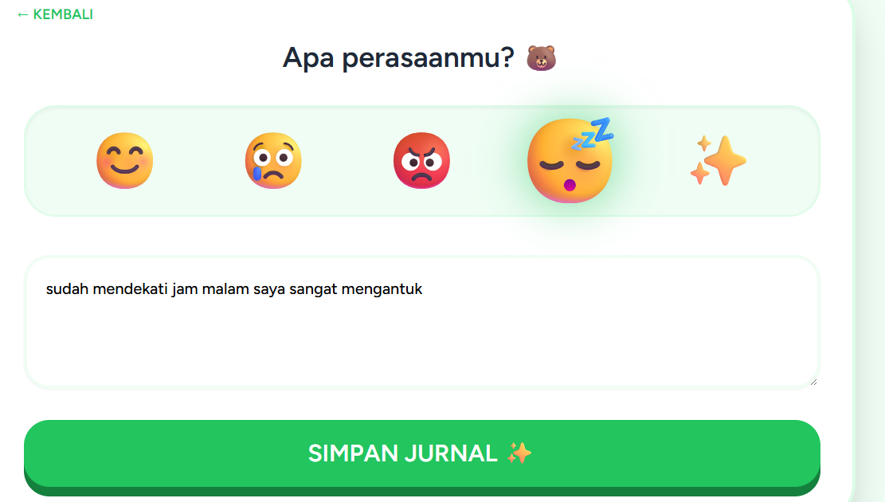
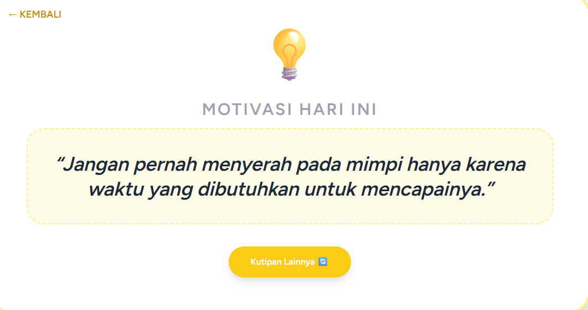
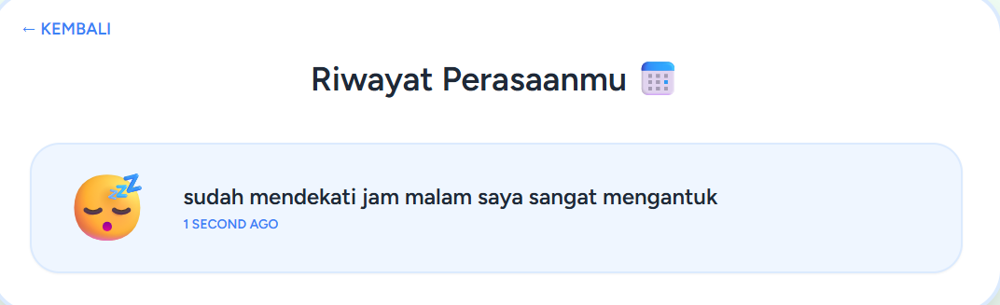

# 🐻 Moodly: Your Daily Mental Health Companion

**Moodly** adalah aplikasi jurnal kesehatan mental berbasis web yang dirancang untuk membantu pengguna melacak, mengekspresikan, dan memahami pola emosi mereka setiap hari. Dengan antarmuka yang ceria dan dukungan maskot "Beruang Moo", aplikasi ini bertujuan untuk menghilangkan hambatan dalam menulis jurnal melalui sistem input yang cepat dan interaktif.

Aplikasi ini dibangun menggunakan framework **Laravel 12**, **Tailwind CSS**, dan **Alpine.js** untuk memberikan pengalaman pengguna yang mulus tanpa hambatan (*low-friction journaling*).

---

---

## 🧠 Struktur Logika (Alur Data)

### 1. Alur Input Data (Create)
* **User Interface**: Pengguna mengisi formulir di Web atau Aplikasi Android.
* **Request Handling**: Frontend mengirimkan data ke fungsi `store()` (untuk Web) atau `storeApi()` (untuk Android) di `MoodController`.
* **Validation**: Controller melakukan validasi data untuk memastikan input tidak kosong dan sesuai format.
* **Database Persistence**: Setelah valid, data disimpan ke dalam tabel `moods` di database MySQL.
* **Feedback System**: Sistem memberikan respon balik berupa pesan "Berhasil Disimpan" ke layar pengguna.

## 📸 Analisis Antarmuka & Fitur Utama

Berikut adalah penjelasan mendetail mengenai alur kerja dan fitur yang ada pada aplikasi Moodly sesuai dengan tampilan antarmuka:

### 1. Dashboard Utama (Personalized Welcome)
Halaman pertama yang menyapa pengguna secara personal. Desain menggunakan kartu navigasi yang modern untuk memberikan fokus pada pilihan tindakan utama.
> 
> * **Personal Greeting**: Sistem secara otomatis menyapa pengguna (Contoh: "Hai, Retta Sembiring!") dengan data dinamis.
> * **Navigation Cards**: Terdapat tiga akses cepat: **Tulis Jurnal** untuk mencatat, **Motivasi** untuk asupan positif, dan **Riwayat** untuk melihat catatan lama.
> * **Interactive UI**: Menggunakan skema warna yang menenangkan dan ikon yang representatif untuk setiap fungsi.

### 2. Mood Picker & Journaling (Sistem Input Cepat)
Fitur inti untuk merekam perasaan tanpa harus mengetik panjang jika sedang lelah.
>  
> *(Catatan: Gunakan kartu Tulis Jurnal untuk masuk ke mode ini)*
> * **Visual Emoji Selection**: Pengguna cukup memilih emoji (Senang, Sedih, Marah, Mengantuk, Berkilau) untuk menentukan mood.
> * **Narrative Textbox**: Tersedia ruang untuk menuliskan detail cerita atau alasan dibalik perasaan tersebut.
> * **Instant Save**: Tombol "Simpan Jurnal" memastikan data terkirim ke database secara aman melalui proteksi CSRF.

### 3. Smart Motivation Engine (Random Quote)
Untuk menjaga kesehatan mental, Moodly menyediakan fitur kutipan bijak yang dapat berubah secara instan.
> 
> * **Zero-Refresh Interaction**: Menggunakan **Alpine.js**, kutipan akan berganti setiap kali tombol "Kutipan Lainnya" diklik tanpa perlu memuat ulang halaman.
> * **Inspiring Content**: Berisi berbagai motivasi hidup untuk membangkitkan semangat pengguna.

### 4. Memory History (Pelacakan Kronologis)
Fitur untuk melihat kembali perjalanan emosi pengguna sebagai bentuk refleksi diri.
> 
> * **Relative Time Formatting**: Menggunakan library **Carbon**, waktu ditampilkan secara natural seperti "1 second ago".
> * **Visual Log**: Menampilkan emoji beserta catatan yang telah disimpan, memudahkan pengguna memantau tren suasana hati mereka.

---

## 🛠️ Detail Teknis (Tech Stack)

* **Framework**: [Laravel 12](https://laravel.com/) (MVC Architecture)
* **Database**: MySQL (Pengelolaan tabel `users` dan `moods`)
* **Frontend**: 
    * **Tailwind CSS**: Untuk styling utility-first yang bersih dan responsif.
    * **Alpine.js**: Mengelola reaktivitas navigasi dan pengacakan kutipan motivasi.
* **Date Handling**: Laravel Carbon untuk manipulasi timestamp yang manusiawi.

---

## 🔧 Panduan Instalasi & Pengembangan

Jika Anda ingin menjalankan proyek ini secara lokal, ikuti langkah berikut:

1. **Clone Repository**:
   ```bash
   git clone [https://github.com/rettakresensia-ops/moodly-app.git](https://github.com/rettakresensia-ops/moodly-app.git)
   cd moodly-app
    ```
2.  **Install Dependencies**:
    ```bash
    composer install
    npm install
    ```
3.  **Setup Database**:
    * Buat database bernama `moodly` di phpMyAdmin.
    * Edit file `.env` dan sesuaikan `DB_DATABASE=moodly`.
4.  **Migrate & Run**:
    ```bash
    php artisan migrate
    php artisan serve
    npm run dev
    ```

---

## ⚠️ Troubleshooting (Penanganan Kendala)

### Error 419 | Page Expired
Biasanya terjadi karena session expired atau token CSRF hilang. Pastikan `@csrf` ada dalam tag form Anda.

### Database Not Updating
Jika kolom baru (seperti `status` atau `emoji`) tidak muncul, jalankan perintah sinkronisasi ulang:
```bash
php artisan migrate:refresh

## 📊 Diagram Arsitektur & Alur Data (API)

```mermaid
graph TD
    A[User / Android Device] -- Request --> B(Laravel API Routes)
    B --> C{MoodController}
    C -- Validasi --> D[Database MySQL]
    D -- Kirim Data --> C
    C -- Response JSON --> E[JSON Data]
    E -- Tampilkan di HP --> A
    
    subgraph "Backend Server"
    B
    C
    D
    end