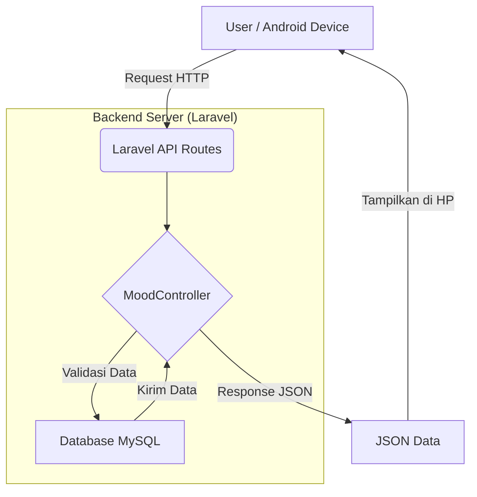

# 🐻 Moodly: Your Daily Mental Health Companion

**Moodly** adalah aplikasi jurnal kesehatan mental berbasis web yang dirancang untuk membantu pengguna melacak, mengekspresikan, dan memahami pola emosi mereka setiap hari.

Aplikasi ini dibangun menggunakan framework **Laravel 12**, **Tailwind CSS**, dan **Alpine.js**.

---

## 🧠 Struktur Logika (Alur Data)

### 1. Alur Input Data (Create)
* **User Interface**: Pengguna mengisi formulir di Web atau Aplikasi Android.
* **Request Handling**: Frontend mengirimkan data ke fungsi `store()` di `MoodController`.
* **Validation**: Controller melakukan validasi data agar tidak kosong.
* **Database Persistence**: Data disimpan ke dalam tabel `moods` di MySQL.
* **Feedback System**: Sistem memberikan respon "Berhasil Disimpan".

---

## 📸 Fitur Utama
* **Dashboard Utama**: Sapaan personal dan navigasi kartu modern.
* **Mood Picker**: Memilih emoji dan menulis detail cerita.
* **Motivation Engine**: Kutipan bijak instan tanpa refresh halaman (**Alpine.js**).
* **Memory History**: Riwayat perasaan dengan format waktu natural (**Carbon**).

---

## 📊 Diagram Arsitektur

# 🐻 Moodly: Your Daily Mental Health Companion

**Moodly** adalah aplikasi jurnal kesehatan mental berbasis web yang dirancang untuk membantu pengguna melacak, mengekspresikan, dan memahami pola emosi mereka setiap hari.

---

## 🧠 Struktur Logika (Alur Data)

### 1. Alur Input Data (Create)
* **User Interface**: Pengguna mengisi formulir di Web atau Aplikasi Android.
* **Request Handling**: Frontend mengirim data ke fungsi `store()` di `MoodController`.
* **Validation**: Controller memastikan data tidak kosong.
* **Database**: Data disimpan ke tabel `moods` di MySQL.
* **Feedback**: Sistem memberikan pesan "Berhasil Disimpan".

---

## 📊 Diagram Arsitektur & Alur Data (API)




## 🛠️ Detail Teknis (Tech Stack)

* **Framework**: [Laravel 12](https://laravel.com/) (MVC Architecture)
* **Database**: MySQL (Pengelolaan tabel `users` dan `moods`)
* **Frontend**: 
    * **Tailwind CSS**: Untuk styling utility-first yang bersih dan responsif.
    * **Alpine.js**: Mengelola reaktivitas navigasi dan pengacakan kutipan motivasi.
* **Date Handling**: Laravel Carbon untuk manipulasi timestamp yang manusiawi.

---

## 🔧 Panduan Instalasi & Pengembangan

Jika Anda ingin menjalankan proyek ini secara lokal, ikuti langkah berikut:

1. **Clone Repository**:
   ```bash
   git clone [https://github.com/rettakresensia-ops/moodly-app.git](https://github.com/rettakresensia-ops/moodly-app.git)
   cd moodly-app
    ```
2.  **Install Dependencies**:
    ```bash
    composer install
    npm install
    ```
3.  **Setup Database**:
    * Buat database bernama `moodly` di phpMyAdmin.
    * Edit file `.env` dan sesuaikan `DB_DATABASE=moodly`.
4.  **Migrate & Run**:
    ```bash
    php artisan migrate
    php artisan serve
    npm run dev
    ```

---

## ⚠️ Troubleshooting (Penanganan Kendala)

### Error 419 | Page Expired
Biasanya terjadi karena session expired atau token CSRF hilang. Pastikan `@csrf` ada dalam tag form Anda.

### Database Not Updating
Jika kolom baru (seperti `status` atau `emoji`) tidak muncul, jalankan perintah sinkronisasi ulang:
```bash
php artisan migrate:refresh 


